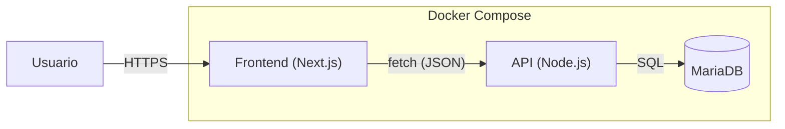

# Documento de Arquitectura — Next.js + Node.js + MariaDB

**Fecha:** 2025-08-25  
**Arquitecto:** @XALEX14410  
**Apoyo QA/Doc:** @Mora-Flores03  
**Repositorio:** [_(URL)_](https://github.com/XALEX14410/sise_lite_hybrid.git)

## 1) Objetivo
Arquitectura **centralizada** y **simple**: Frontend en **Next.js**, API en **Node.js**, base de datos **MariaDB**, todo bajo **Docker**. Incluye flujos básicos y **gobernanza de revisiones** con responsables por área.

## 2) Tipo de arquitectura y justificación
**Centralizada (API única + frontend separado)**  
- **Simplicidad:** menos piezas, más velocidad para el equipo.  
- **Escalado horizontal sencillo:** contenedores `web` y `api`.  
- **SSR/ISR** de Next.js para SEO/TTFB.  
- **Evolutiva:** permite extraer módulos a servicios si el crecimiento lo exige.

## 3) Componentes
- **Cliente:** Navegador del usuario (Edge, Firefox, Chrome, etc.).
- **Frontend (Next.js):** Renderizado SSR/ISR; consume datos desde la API.
- **API (Node.js):** Controladores, servicios y repositorios; autenticación vía JWT en cookie httpOnly.
- **Base de datos (MariaDB):** Persistencia relacional; soporte para migraciones y seeds.
- **Docker Compose:** Orquestación para arranque local de todos los servicios.

## 4) Diagrama general (editable)
Ver `diagrams/sistema/arquitectura_sistema.mmd` (Mermaid).




## 5) Flujos de comunicación (resumen)
1. **SSR/ISR:** Next.js renderiza páginas en servidor y obtiene datos desde la API.  
2. **CRUD:** Frontend → API → DB; respuestas JSON.  
3. **Auth:** Login emite JWT (cookie httpOnly + SameSite).

## 6) Despliegue local (Docker)
- `infra/docker-compose.yml` inicia `db`, `api`, `web`.  
- `.env.example` con variables mínimas.  
- `infra/api/Dockerfile` y `infra/web/Dockerfile` como plantillas.

## 7) Estructura de repo
```
/docs
  arquitectura.md
/diagrams
  arquitectura.mmd
/infra
  docker-compose.yml
  /api/Dockerfile
  /web/Dockerfile
.github/CODEOWNERS
.github/PULL_REQUEST_TEMPLATE.md
.env.example
```

## 8) Gobernanza: dueños y revisores
**Code Owners propuestos** (ver archivo `/.github/CODEOWNERS`):
- **/**            → @XALEX14410 @Mora-Flores03
- **/frontend/**   → @Alex-LaLa @Mora-Flores03 @XALEX14410
- **/backend/**    → @js-ph @Mora-Flores03 @XALEX14410
- **/db/**         → @Daniel37UwU @Mora-Flores03 @XALEX14410
- **/docs/**       → @ClCrr @Mora-Flores03 @XALEX14410

**Regla de aprobación:** mínimo **2 aprobaciones** por PR:  
1) **QA/Doc**: @Mora-Flores03 (siempre).  
2) **Dueño del área** impactada (Frontend/Backend/DB/Docs) **que no sea autor**.  
- Si el dueño del área es autor, el 2.º revisor será **@XALEX14410** o el dueño del área predominante alternativa.

## 9) Definition of Done (historia)


La siguiente arquitectura ha sido revisada y validada por los siguientes miembros del equipo:

- **@Mora-Flores03** (QA/Documentación) — 2025-09-04
- **@XALEX14410** (Arquitecto) — 2025-09-04

Se deja constancia de la validación para cumplir con la definición de "Done".
