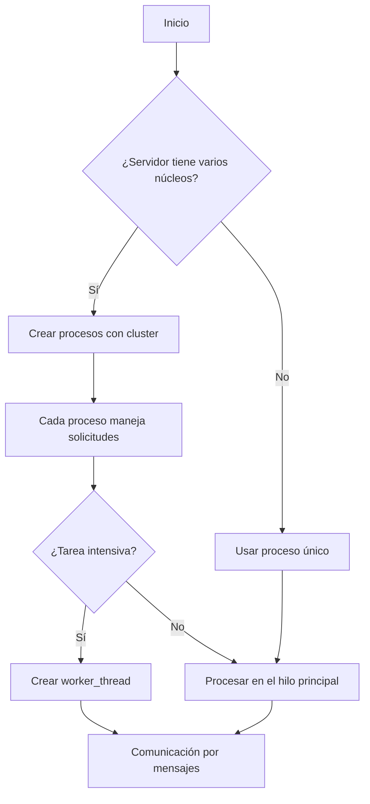

# Definición del modelo de hilos y procesos


## 0. Tecnologías y lenguajes utilizados
- **Backend:** Node.js (JavaScript), Express.js
- **Frontend:** Next.js (React, JavaScript/TypeScript)
- **Base de datos:** MariaDB (compatible con MySQL, pero por defecto en XAMPP y preferida por rendimiento y licencia)

El modelo de hilos y procesos se enfoca principalmente en el backend, donde Node.js es monohilo pero permite concurrencia usando procesos e hilos.

## 1. Conceptos básicos (explicación para juniors)
- **Proceso:** Es como una aplicación independiente que corre en tu computadora. Cada proceso tiene su propia memoria y recursos.
- **Hilo:** Es como un ayudante dentro de un proceso, que puede ejecutar tareas al mismo tiempo que otros ayudantes.
- **Concurrencia:** Permite que varias tareas se ejecuten "al mismo tiempo" (aunque en realidad se alternan rápidamente).
- **Paralelismo:** Varias tareas realmente se ejecutan al mismo tiempo, aprovechando varios núcleos del procesador.

**Analogía:** Imagina una cocina con varios chefs (procesos) y cada chef tiene varios ayudantes (hilos). Así se preparan más platillos a la vez.

## 2. Explicación general del modelo propuesto
Node.js por defecto usa un solo hilo, pero para aprovechar todos los núcleos del servidor y realizar tareas pesadas, se recomienda:
- Usar el módulo `cluster` para crear varios procesos (uno por núcleo).
- Usar el módulo `worker_threads` para tareas intensivas dentro de cada proceso.
- Comunicar procesos e hilos mediante mensajes.

## 3. Diagrama de flujo detallado



## 4. Ejemplo de código (Node.js)

```js
// cluster.js
const cluster = require('cluster');
const os = require('os');
if (cluster.isMaster) {
    const numCPUs = os.cpus().length;
    for (let i = 0; i < numCPUs; i++) {
        cluster.fork();
    }
    cluster.on('exit', (worker) => {
        console.log(`Worker ${worker.process.pid} murió. Reiniciando...`);
        cluster.fork();
    });
} else {
    require('./server.js'); // Tu servidor Express
}
```

```js
// worker_threads.js
const { Worker, isMainThread, parentPort } = require('worker_threads');
if (isMainThread) {
    const worker = new Worker(__filename);
    worker.postMessage('Haz una tarea pesada');
    worker.on('message', (msg) => console.log('Resultado:', msg));
} else {
    parentPort.on('message', (msg) => {
        // Simular tarea pesada
        let result = msg + ' completada';
        parentPort.postMessage(result);
    });
}
```

## 5. Justificación técnica
- **Node.js es monohilo**, pero permite crear procesos e hilos para aprovechar mejor el hardware.
- **Cluster**: Permite balancear carga y usar todos los núcleos.
- **Worker Threads**: Evita que tareas pesadas bloqueen el servidor.
- **Escalabilidad y robustez**: Si un proceso falla, se reinicia automáticamente.

## 6. Propuesta de librerías/APIs
- [`cluster`](https://nodejs.org/api/cluster.html): Para crear procesos hijos y balancear carga.
- [`worker_threads`](https://nodejs.org/api/worker_threads.html): Para ejecutar tareas en hilos separados.
- [`pm2`](https://pm2.keymetrics.io/): Para gestión y monitoreo de procesos en producción.

## 7. Validación y monitoreo
- Usar PM2 para monitorear procesos y reiniciar automáticamente en caso de fallos.
- Validar la factibilidad con el equipo backend.

## 8. Validación del equipo backend
**Responsable de validación:** @Joseph Ruano

> Comentarios y validación de factibilidad de implementación:
> (Espacio para que el equipo backend agregue observaciones y apruebe la propuesta)

---

**Este documento está sujeto a revisión y actualización según las necesidades del equipo y los avances del proyecto.**
