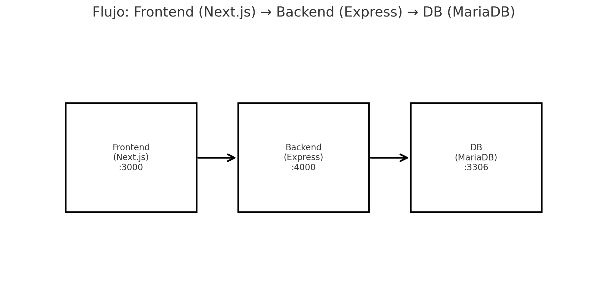

# Proyecto — Arquitectura mínima (Frontend → Backend → DB)



## Objetivo
Tener un sistema **mínimo** corriendo en **3 contenedores**:
- **Frontend (Next.js)** en `http://localhost:3000`
- **Backend (Express/Node.js)** en `http://localhost:4000`
- **Base de Datos (MariaDB)** en `localhost:3306`

## Cómo levantarlo
Asegúrate de estar en la carpeta `proyecto/` del repositorio y de tener Docker y Docker Compose instalados.

```bash
docker compose up -d --build
```

> Si es la primera vez, `--build` garantiza que las imágenes se construyan con los últimos cambios.

## Cómo probarlo
1. Abre: `http://localhost:3000`
2. Crea un **item** desde la interfaz (ej. un título y una descripción).
3. Verifica que el item aparezca en la lista y persista tras recargar la página.

### Notas rápidas
- El frontend llama al backend en `/api` (proxy o variable de entorno, según configuración).
- El backend expone endpoints REST (ej. `POST /items`, `GET /items`) y se conecta a MariaDB.
- La base de datos persiste datos en un volumen Docker.

## Diagrama
El diagrama muestra el flujo de información: **Frontend (Next.js) → Backend (Express) → DB (MariaDB)**.  
El archivo de imagen del diagrama está en `arquitectura-minima-frontend-backend-db.png`.

---

> **Evidencia**: README actualizado + diagrama mostrando la arquitectura.
